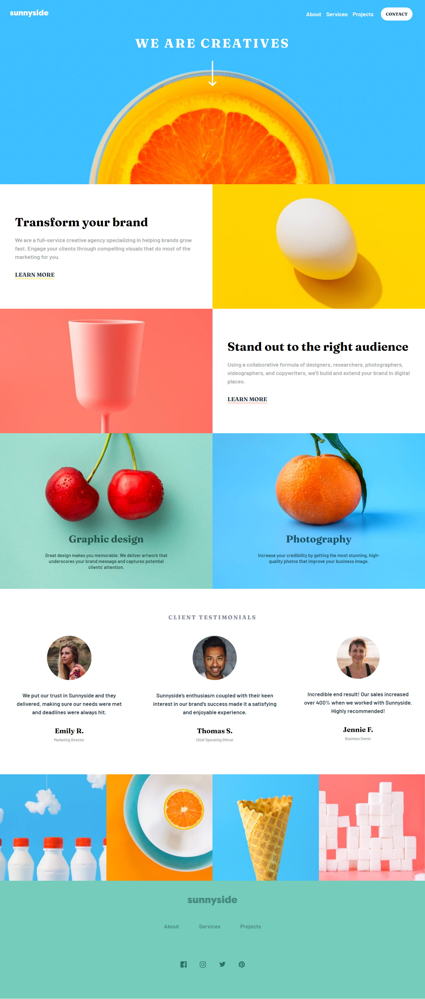

# Frontend Mentor - Sunnyside agency landing page solution

This is a solution to the [Sunnyside agency landing page challenge on Frontend Mentor](https://www.frontendmentor.io/challenges/sunnyside-agency-landing-page-7yVs3B6ef)

## Preview

Live Site URL: [Add live site URL here](https://medavyshnavi.github.io/Sunnyside-agency-Landing-Page/)

## My process

### Built with

- Semantic HTML5 markup
- CSS custom properties
- Flexbox
- Sass

### What I learned

Minute Details required for creating responsive web pages. This solution presents optimal layout for the site depending on their device's screen size (desktop, mobile and tablet) and hover states for interactive elements.

For mobile navigation toggle I have tried sticking to css only though easier with js.

### Continued development

Further on I want to continue working on refining the code and optimising as much as possible.

Frontend Mentor  [Meda Vyshnavi](https://www.frontendmentor.io/profile/medaVyshnavi)
